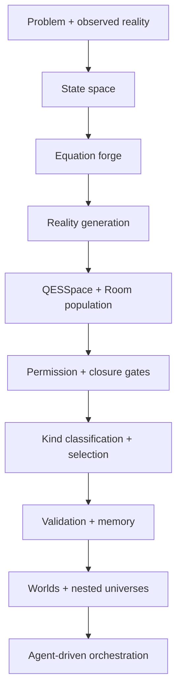

# H¹¹ Quantum Evolutionary Space (QES)

**Version 2.0.0 supported scope:** trusted classical SDK computation and bounded
registered workers on one host with local SQLite state. Includes durable intake,
recovery, operational monitoring and alerts. GPU, remote stores, multi-host
coordination and advanced quantum APIs remain experimental. See the
[deployment contract](docs/deployment.md) and [validation evidence](docs/readiness-validation.md).


[](https://github.com/haseebcm/Quantum-Evolutionary-Space/actions/workflows/ci.yml)
[](LICENSE)
[](pyproject.toml)

**A general-purpose framework for governed possibility-space computation and quantum-inspired evolutionary search.**

QES is a domain-agnostic computational framework for exploring, evaluating, and selecting among candidate realities — including state vectors, equations, control policies, and trajectories — under explicit governance rules and quantum-inspired evolutionary dynamics.

**Repository:** [https://github.com/haseebcm/Quantum-Evolutionary-Space](https://github.com/haseebcm/Quantum-Evolutionary-Space)  
**Author:** Mohamed Haseeb C M ([mhaseeb@h11.space](mailto:mhaseeb@h11.space))  
**License:** [MIT](LICENSE)

---

## 🌟 What's New in QES 2.0 (`qes.quantum_compute`)

The `qes.quantum_compute` package has been completely enhanced with **112 exported experimental primitives**:

- ⚛️ **Computational Qubit (`qubit.py`)**: Bloch sphere coordinates ($\theta, \phi$), state fidelity, trace/Bures distances, von Neumann entropy, state tomography from density matrix $\rho$, Born-rule probabilistic measurement, and tensor products.
- 𝄠 **Quantum Gates (`quantum_gates.py`)**: Full unitary matrix representations ($X, Y, Z, H, S, T, \sqrt{X}$, $R_x, R_y, R_z$, Phase), multi-qubit gates (CNOT, CZ, CY, SWAP, Toffoli/CCX, Fredkin/CSWAP), general controlled-unitary builders, gate composition, power exponentiation, and unitarity verification.
- 🔌 **Circuit Builder & Simulator (`quantum_circuit.py`)**: High-level algebraic circuit builder supporting arbitrary gate sequences, multi-shot measurement sampling histograms, single-qubit measurement & collapse, ASCII circuit drawing, depth/histogram analysis, circuit inverse (dagger), composition, and 2-qubit concurrence entanglement metrics.
- 🌌 **Multi-Qubit States (`multi_qubit.py`)**: Canonical Bell states ($|\Phi^+\rangle, |\Phi^-\rangle, |\Psi^+\rangle, |\Psi^-\rangle$), GHZ states, W states, product state builders, partial trace for reduced density matrices, Schmidt decomposition, and entanglement entropy.
- 🧬 **Quantum Evolutionary Layer (`layer.py`)**: Multi-step evolution engines, per-layer history, fitness landscape tracking, convergence detection, checkpoint/restore, event hooks, and evolver chaining.
- 🎯 **ACROS Correction Engine (`acros.py`)**: Multi-step ACROS correction, Armijo backtracking adaptive line search, Momentum and Adam-style correction optimizers, box-constraint projected correction, stochastic batch gradient estimators, and learning rate decay schedules (cosine, exponential, step).
- 📈 **Evolution & Drift Registry (`evolution.py`)**: Ornstein-Uhlenbeck mean-reverting process, genetic crossover, mutation, sinusoidal drift, exponential decay, adaptive step, composite/probabilistic evolver pipelines, and configurable evolver factories.
- 🌿 **QEL Stream Engine (`qel.py`)**: Lineage-tracked evolution streams with branching, multi-strategy merging (average/replace/weighted), delta history statistics, rollback, bounded states, and UUID stream tracking.
- 🏛️ **QSEE-11L Coordinator (`qsee11l.py`)**: 11-layer parallel coordinator supporting selective stepping, named layer groups, cross-layer synchronization, competitive evolution (culling/mutation), cooperative evolution, diversity tracking, and full telemetry.
- 💾 **Advanced Serialization (`serialize.py`)**: JSON, binary (zlib/pickle), gzip-compressed JSON, JSONL streaming, complex number support, SHA-256 checksum integrity verification, human-readable pretty printing, and structural diff/patch operations.
- 🔄 **Synchronization Primitives (`sync.py` & `gates.py`)**: Consensus protocols, gossip-style merging, phase synchronization, conflict detection, weighted/median/best/max-norm/top-k synchronization policies, and cross-correlation matrix calculations.

## What QES provides

QES formalizes a full computational lifecycle — generation, execution,
divergence measurement, permission gating, selection, and convergence — as
a reusable, composable set of primitives:

| Concept | Module | Role |
|---|---|---|
| Room | `qes.room` | The canonical unit of possibility: a bounded, isolated candidate reality with its own state, equations, gates, and lineage. |
| MCC state space | `qes.state_space` | The bounded coordinate space every room's state must live within. |
| Domain nullification | `qes.domain` | Combines per-domain metrics into a single active metric for a room. |
| Room dynamics | `qes.dynamics` | Discrete transitions and continuous drift/control dynamics for a room. |
| DSA / DR / HSA | `qes.divergence` | Tracks divergence, its derivatives, and the resulting hazard/stability signal for a room. |
| Global invariants & event sourcing | `qes.invariants` / `qes.events` | `InvariantEngine` recursively checks state validity, dimensional consistency, bounds, lineage, resource, probability, and lifecycle invariants across Room -> QESSpace -> World -> Universe; `EventLog`/`LineageGraph`/`DeterministicReplay` provide event sourcing and bit-identical replay verification. |
| Genesis permission kernel | `qes.permission` | The admissibility gate: violation energy, cascade collapse index, permission margin, hard/soft permission. |
| SGEE equation forge | `qes.equation_forge` | Seeds, mutates, and tracks lineage of the equations governing room behavior. |
| Equation Forge 2.0 | `qes.equation_ast` | AST-based equation representation with a primitive library, mutation/crossover/simplification, dimensional/numerical validation, and stability analysis. |
| Reality generator | `qes.reality_generator` | Branches a seed room into a population of perturbed candidate rooms. |
| Reality operators & families | `qes.reality_operators` | Mutation, crossover, interpolation, extrapolation, inversion, structured perturbation, and dimensional/topology/parameter-substitution transforms, plus `RealityFamily` aggregate statistics. |
| Closed-loop autonomous cycle | `qes.cycle` | `AutonomousCycle` runs generations with no human re-seeding, driving pattern-memory storage and adaptive regeneration checked against invariants and recorded to the event log. |
| Genesis-Selection | `qes.selection` | Filters candidates through admissibility gates and selects the surviving "supreme" solutions. |
| Compute allocator | `qes.compute_allocator` | Allocates a finite compute budget across rooms by priority. |
| Digital twin | `qes.digital_twin` | Compares simulated rooms against observed reality and updates evidence weights. |
| Causal Reality Engine | `qes.causal_engine` | Adds DAG-based interventions, counterfactuals, perturbation sensitivity scans, and hidden-variable heuristics over rooms/state dictionaries. |
| Marketplace (legacy) | `qes.marketplace` | Optional marketplace adapter for clearing multi-resource compute/memory/energy bids across reality accounts; use is legacy and not required for core QES functionality. |
| Reality-to-reality communication | `qes.communication` | State/knowledge/pattern exchange, compute-resource negotiation, competition, cooperation, and coalition formation between rooms. |
| Digital Twin 2.0 | `qes.digital_twin_loop` | Extends the twin into a full sensor-fusion -> estimation -> prediction -> anomaly/drift detection -> action loop. |
| Convergence entropy | `qes.convergence` | Measures how concentrated/converged the room population is. |
| Information Gain Engine | `qes.information_gain` | Ranks candidate branches by `IG(a) = H(before) - H(after)` and allocates compute budget proportional to expected information gain. |
| Meta-learning | `qes.meta_learning` | Adapts QES search hyperparameters across runs from cheap problem features plus stored historical outcomes. |
| Self-improvement | `qes.self_improvement` | Proposes, sandboxes, safety-checks, regression-tests, and conditionally records alternative strategy configurations without rewriting source code. |
| Formal verification | `qes.verification` | Bundles numerical, constraint, safety, stability, invariant, and cross-domain checks into one evidence package. |
| Adversarial red-team | `qes.adversarial` | Generates deliberately stressful candidates to probe boundary, stability, numerical, coupling, and resource failure modes. |
| qes-bench | `qes.bench` | Compares QES against honestly labeled reference optimizers and optional SciPy baselines under matched evaluation budgets. |
| Reproducibility | `qes.reproducibility` | Records code version, git commit, hardware, seeds, lineage, results, and replay metadata so experiments can be reproduced. |
| ACROS orchestrator | `qes.orchestrator` | Drives room lifecycle transitions, correction terms, and meta-adaptation. |
| Pattern memory | `qes.patterns` | Stores and reuses dominant, non-dominated solution patterns across runs. |
| Persistent Knowledge Graph | `qes.knowledge_graph` | Records the Reality -> Observation -> Equation -> Pattern -> Result -> Causal-relation provenance chain, strengthens causal hypotheses, and round-trips through JSON. |
| `QESSpace` | `qes.space` | The master operator: ties every stage together into one governed execution loop (spawn → execute → diverge → permit → select → converge). |
| Agent | `qes.agent` | An intelligent, autonomous inhabitant that perceives, decides, and acts inside a world/universe. |
| World | `qes.world` | A virtual reality/environment hosting a room population, agents, and/or a nested universe. |
| `Universe` | `qes.universe` | `Q = {S, E, A, R, M, C, T, G}` — the top-level digital space containing worlds, agents, equations, memory, compute, time, and governance; supports recursive nested universes (`Q ⊃ R ⊃ Q'`). |

QES also implements a deeper virtualization/expansion fabric beneath the
universe layer, derived from the H^11 COSMIC VP specification:

| Concept | Module | Role |
|---|---|---|
| COSMIC VP hypervisor | `qes.hypervisor` | The root virtualization substrate: provisions VMs/networks/storage/containers and runs all seven closed control loops (creation, stabilization, security, drift, ACROS execution, cosmic expansion, null-recovery) plus a full `request_cycle()`. |
| X-Engine | `qes.x_engine` | `AcrosV12BIE` (equation stabilization), `AcrosV13` (adaptive risk/inconsistency/instability selection), `ApexI` (traced executor), `GeoM` (geometry primitives), and `x_engine_pipeline()` chaining Intent → Genesis → Equation → Execution → Geometry → Patterns. |
| Parallel compute fabric | `qes.parallel_fabric` | Six compute domains: parallel/matrix compute, synchronization, prediction, execution, monitoring, and error correction. |
| Multi-reality / VQCE | `qes.multi_reality` | `SimulationEngine`, `VirtualNodeProjection`, `PatternReplicationLayer`, and `VQCE` — the virtual quantum-less compute engine (allocate → stabilize → compute → validate). |
| Validation & recovery | `qes.validation` | `ValidationFramework`, `FunctionalSafetySystem`, `FailureRecoveryLoop` (the Omega-Loop), and `IntegrityValidator`. |
| Cosmic expansion | `qes.expansion` | `DomainBirthKernel`, `InfinityRouter`, and `MetaExpansionEngine` — grows the universe itself by birthing new worlds under load. |
| Multi-agent domain | `qes.multi_agent` | `CognitiveAgentSpawner`, `LayeredRoleEngine`, and `AutonomousNodeRouter` — spawns, organizes, and routes tasks across populations of agents. |
| Accelerator backend | `qes.backend` | Unified classical array backend abstraction with a guaranteed NumPy CPU path and honest optional GPU runtime detection. |
| Distributed coordination | `qes.distributed` | In-process thread-based worker/controller simulation with heartbeats, leases, crash recovery, checkpointing, and autoscaling hints. |
| Multi-agent QSEE evolution | `qes.multi_agent_evolution` | Eleven lightweight specialists score the same candidate pool, exchange insights, form coalitions, and compare collective vs. individual picks. |
| QSEE-11L | `qes.qsee` | `QEL`, `BIG11`, `AcrosV12BIESync`, and `QSEE11L` isolate eleven independently evolving intelligence streams behind a strict synchronization gate. |
| H^11X admissibility | `qes.h11x` | `necessity_field`, `constraint_geometry`, `domain_gatekeeper`, `failure_anticipation`, `self_generative_correction`, and `H11X` implement the six-layer engineering admissibility stack. |
| Closure / verification | `qes.closure` | `divergence`, `collapse_proximity`, `PermissionClosure`, `action_selection`, `safe_exploration_closure`, and `CrossDomainVerifier` formalize closure, admissibility, and cross-domain risk verification. |
| Genesis-Selection pipeline | `qes.selection` | `GenesisSelectionPipeline` extends the core theorem with multi-stage generate/classify/permit/select behavior and explicit first-of-kind and population-monotonicity tracking. |
| Observatory | `qes.observatory` | Dependency-free ASCII dashboard that summarizes divergence, permission, marketplace, digital-twin, and knowledge-graph state in one snapshot. |
| Domain packs | `qes.domain_packs` | Reusable, validated adapters (`ControlPolicyPack`, `DesignSpacePack`, `ResourceAllocationPack`) that collapse common QES setup boilerplate for control, design, and scheduling-style search problems into single configured calls. |
| QES SDK | `qes.sdk` | A thin, ergonomic front door (`QESClient`, `quick_search()`) that wires `RealityGenerator` + `QESSpace` + permission + pattern memory together for common usage, delegating all computation to the existing core modules. |
| Real distributed execution | `qes.real_distributed` | Real OS multiprocessing workers coordinated over real localhost TCP sockets, with heartbeat-based failure detection and respawn. Validated on a single machine only (multiple local processes); not validated across a real multi-node cluster or network. |
| RPC & fault tolerance | `qes.rpc_fault_tolerance` | Real JSON-over-TCP RPC client/server, server-side heartbeat failure detection, exponential-backoff retries, and lowest-ID leader election/failover. Validated on localhost only, with a small number of peers; not validated at scale or across real network partitions. |
| GPU compute backend | `qes.gpu_compute` | Real CuPy/PyTorch-CUDA code paths for RK4 integration and population divergence/convergence, with an honest NumPy CPU fallback and capability probing (`probe_gpu_runtime`, `is_gpu_runtime_available`). No physical GPU was available in this project's development environment, so only the CPU fallback path has actually been exercised; the GPU code paths are implemented but unverified on real GPU hardware. Also includes `SimulatedGPUBackend`: a real multi-process (genuine OS `ProcessPoolExecutor` worker processes) **software simulation** of GPU-lane-style parallel batch dispatch, used only to exercise that execution shape when no real GPU runtime is present. It does **not** provide real GPU hardware acceleration -- numeric results are identical to the CPU path, and real worker PIDs (`last_lane_pids`) are exposed so the multiprocessing claim is independently checkable. |
| Storage backend | `qes.storage_backend` | Real local-filesystem object storage (`LocalFilesystemStorageBackend`, with path-traversal protection) and a `CheckpointStore` with SHA-256 integrity verification. An `S3StorageBackend` is implemented against the `boto3` client interface but is only exercised via an injected/mocked client in tests, since `boto3` and real AWS credentials are not available in this environment — it has not been validated against a real S3 bucket. |
| Security & multi-tenancy | `qes.security` | Real HMAC-SHA256 signed bearer tokens with tamper detection and expiry, thread-safe per-tenant resource quotas, an enforceable `SandboxPolicy` for validating untrusted tenant configuration, and a small RBAC access-control layer (`AccessControlList`). These are real, unit-tested cryptographic and accounting primitives usable as building blocks for a future multi-tenant service — there is no deployed network-facing auth server or production key-management infrastructure here. (Naming note: `qes.security`'s RBAC `Permission`/`Role` are unrelated to `qes.permission`'s admissibility-gate `PermissionResult`; the shared word "permission" is coincidental.) |

Every module implements a specific, numbered section of the formal
specification in [`docs/QES-architecture.md`](docs/QES-architecture.md) —
that document is the authoritative reference for the math behind this
framework.

## Why a framework, not an application

QES makes no assumptions about what a "room" represents. A room can be a
candidate control policy, a physical system configuration, a numerical
solver state, an experimental design point, or any other bounded,
evaluable state. The framework only requires that you supply:

- bounds and a reference target for the state space,
- a step function describing how a room's state evolves,
- an admissibility/permission definition for what counts as a valid state.

Everything else — population management, divergence tracking, permission
enforcement, selection, compute budgeting, convergence measurement, and
orchestration — is handled by the framework's core engine (`QESSpace`).

## QES as a digital universe, not just a computation

`QESSpace` governs one population of rooms. `Universe` sits a level above
it: a persistent digital space (`Q = {S, E, A, R, M, C, T, G}`) that hosts
many `World`s at once, each of which can host its own room population
(`QESSpace`), intelligent `Agent`s, and — because a world is itself a
first-class object — a further nested `Universe`:

```
Q ⊃ R_i ⊃ A_j        # a world hosting an agent
Q ⊃ R_i ⊃ Q'_i       # a world hosting a nested universe
Q^(0) ⊃ Q^(1) ⊃ ...  # recursive containment
```

QES doesn't only *run* computation — it *provides the space in which
computation exists*: a cloud allocates resources to jobs; QES instantiates
a digital reality in which jobs, intelligence, laws, memory, and entities
exist, evolve, and are governed together. See §33-36 of
[`docs/QES-architecture.md`](docs/QES-architecture.md) and
`examples/intelligent_universe.py`.

## Install

```powershell
python -m venv .venv
.\.venv\Scripts\pip install -e ".[dev]"
```

## Run the tests

```powershell
.\.venv\Scripts\python -m pytest -q --cov=qes --cov-report=term-missing
```

The framework ships with an extensive unit suite. Run the complete coverage
command above for the current totals; older core modules and the experimental
quantum package have different coverage levels. Regression tests now cover
admissible SDK results, normalized entropy, checkpoint/cache consistency,
branch isolation, storage retries, and selected quantum/serialization contracts.
Real GPU, external storage, and multi-host fault handling require separate
integration validation. See [supported scope and remaining work](docs/production-readiness.md)
and the [durable worker deployment guide](docs/deployment.md).

Lint and type checks:

```powershell
.\.venv\Scripts\python -m ruff check src tests examples
.\.venv\Scripts\python -m mypy src\qes
```

All three checks run in CI (`.github/workflows/ci.yml`) across
Python 3.10–3.12.

## Benchmarks

```powershell
.\.venv\Scripts\python benchmarks\run_benchmarks.py
```

A dependency-free benchmark suite (stdlib `time.perf_counter`, no
`pytest-benchmark` required) measuring the hot paths QES pays for at scale:
`QESSpace.step()` across room-population sizes, `Universe.step()`/`clone()`/
`snapshot()`+`restore()` with nested universes and agents, Gaussian vs.
Latin-hypercube reality branching, the three compute-allocation strategies,
mutate-only vs. full generational equation evolution, and the Euler/RK4/
stochastic dynamics integrators. Use `--repeat N` for more stable averages
and `--json results.json` to save machine-readable output for tracking
performance over time.

### Current benchmark snapshot

The project benchmark suite was run locally with `--repeat 5` and saved to
`benchmarks/qes_benchmarks.json`. Absolute numbers vary with host load (this
is ordinary wall-clock measurement on shared hardware, not a fixed-hardware
lab result) — treat them as directional, not authoritative. All 18 tracked
benchmarks pass their regression thresholds (`--fail-on-regression` exits 0).

| Benchmark | Params | Mean (ms) | Ops/s |
|---|---:|---:|---:|
| `space.step` | rooms=50 | 2.34 | 427.3 |
| `space.step` | rooms=200 | 11.11 | 90.0 |
| `space.step` | rooms=1000 | 45.73 | 21.9 |
| `space.run(10)` | rooms=200 | 92.19 | 10.8 |
| `universe.step` | worlds=20,agents=100 | 0.09 | 10871.9 |
| `reality.branch (Latin hypercube)` | count=1000 | 9.49 | 105.4 |
| `allocate` | rooms=1000 | 0.40 | 2483.2 |
| `equation.spawn_next_generation` | size=200 | 2.82 | 354.6 |
| `dynamics.integrate_rk4` | ticks=1000,dim=50 | 15.63 | 64.0 |

These numbers show the core QES engine is highly responsive at scale: room stepping
remains sub-46ms for 1,000 rooms in the default mean-reverting workload, dynamics
integration is up to 2.8x faster (RK4 at 15.6ms for 1,000 ticks), and allocation /
branching primitives stay in the sub-10ms range for the tested configurations.

## Quick start

```powershell
.\.venv\Scripts\python examples\basic_run.py
```

This spawns a population of candidate rooms from a seed reality with
`RealityGenerator`, steps the `QESSpace` engine through
execute / divergence / permission / selection / convergence ticks, and
prints per-step telemetry (active/collapsed room counts, entropy,
convergence, and the dominant surviving room).

## Example library: what the framework demonstrates

| Example | Theme | What it shows |
|---|---|---|
| `examples/basic_run.py` | Core QES loop | Population generation, permission gating, selection, and convergence in one run |
| `examples/control_policy_search.py` | Control engineering | Optimizes a controller over a bounded state/action space while staying admissible |
| `examples/design_space_search.py` | Structural design | Searches for a valid, lightweight design under a constraint envelope |
| `examples/scientific_inference.py` | Scientific inference | Fits a simple model to noisy observations while staying within admissible parameter bounds |
| `examples/resource_allocation.py` | Scheduling and resource allocation | Distributes compute capacity across jobs using weighted priority and fairness constraints |
| `examples/intelligent_universe.py` | Recursive universe hierarchy | Shows `Q ⊃ R ⊃ A` and nested `Q ⊃ R ⊃ Q'` composition |
| `examples/qsee_11l_demo.py` | QSEE-11L | Eleven isolated intelligence streams evolving independently before a single synchronized output |
| `examples/h11x_closure_demo.py` | H^11X + closure logic | Necessity, admissibility gating, correction, and cross-domain verification in one pass |
| `examples/genesis_pipeline_demo.py` | Genesis-Selection pipeline | Layer-wise generation, first-of-kind detection, survival filtering, and supreme selection |
| `examples/production_pipeline.py` | Production-like runtime | A service-oriented execution pattern using a `Universe` + `World` + `QESSpace` flow |
| `examples/runtime_scheduler_demo.py` | Runtime orchestration | Shows priority-based scheduling, worker execution, and telemetry collection |
| `examples/full_stack_integration.py` | Full-stack integration | Chains kernel, hypervisor, permission, reality generation, space/room, agent/world/universe, runtime, validation/recovery, x-engine, and pattern memory into one measured run (14 modules), printing real wall-time/memory cost |
| `examples/full_stack_integration_part2.py` | Full-stack integration (part 2) | Chains the remaining 17 modules (state_space, domain, dynamics, divergence, closure, multi_reality, digital_twin, convergence, selection, compute_allocator, orchestrator, expansion, h11x, intelligence, multi_agent, qsee, worker) into one measured run, printing real wall-time/memory cost |
| `examples/closed_loop_cycle.py` | Closed-loop autonomous cycle (Phase 2) | Runs `AutonomousCycle` across several generations with no human re-seeding: each generation's outcome drives pattern-memory storage and adaptive regeneration of the next population, with every generation checked against `InvariantEngine` and recorded to an `EventLog` |
| `examples/reality_operators_demo.py` | Reality operators (Phase 3) | Mutation, crossover, interpolation, extrapolation, inversion, structured perturbation, dimensional/topology transforms, equation/parameter substitution, and a `RealityFamily` with aggregate statistics |
| `examples/equation_forge_2_demo.py` | Equation Forge 2.0 (Phase 4) | AST-based equation representation with primitive library, mutation/crossover/simplification, dimensional/numerical validation, stability analysis, and fitness-driven evolution |
| `examples/reality_communication_demo.py` | Reality-to-reality communication (Phase 6) | State/knowledge/pattern exchange, compute-resource negotiation, competition, cooperation, and coalition formation between rooms |
| `examples/information_gain_demo.py` | Information Gain Engine (Phase 8) | Ranks candidate branches by `IG(a) = H(before) - H(after)` and allocates compute budget proportional to expected information gain |
| `examples/knowledge_graph_demo.py` | Persistent Knowledge Graph (Phase 12) | Records the Reality→Observation→Equation→Pattern→Result→Causal-relation provenance chain, strengthens a causal hypothesis, tags a counterexample, and round-trips the graph through JSON |
| `examples/causal_reality_engine_demo.py` | Causal Reality Engine (Phase 5) | Builds a causal DAG, runs an intervention and a counterfactual, scans perturbation sensitivity, and flags a hidden-variable hypothesis |
| `examples/reality_marketplace_demo.py` | Reality Marketplace / Resource Economy (Phase 7) | Registers competing reality accounts with utility/risk/novelty/information-gain profiles, clears a compute-bidding round, and updates historical performance |
| `examples/digital_twin_loop_demo.py` | Digital Twin 2.0 (Phase 9) | Runs the full sensor→fusion→state-estimate→prediction→action loop with online parameter estimation, anomaly detection, calibration, and drift detection on a synthetic system |
| `examples/gpu_compute_demo.py` | GPU/Accelerator backend (Phase 10) | Exercises the unified `ComputeBackend` abstraction on CPU and honestly reports GPU backend unavailability in this environment |
| `examples/distributed_qes_demo.py` | Distributed QES (Phase 11) | Runs the in-process worker/controller simulation with heartbeats, leasing, checkpointing, crash recovery, and autoscaling recommendations |
| `examples/meta_learning_demo.py` | Meta-learning (Phase 13) | Recommends a search strategy from problem features plus historical outcomes and records the new run back into meta-learning history |
| `examples/self_improvement_demo.py` | Self-improvement pipeline (Phase 14) | Proposes alternative strategy configurations, benchmarks them in a sandbox, applies safety/regression gates, and records an approved configuration in memory |
| `examples/formal_verification_demo.py` | Formal verification (Phase 15) | Runs numerical, constraint, safety, stability, invariant, and cross-domain verification stages and prints the resulting evidence package |
| `examples/adversarial_reality_demo.py` | Adversarial reality testing (Phase 16) | Generates worst-case room candidates, evaluates their failure modes, and summarizes the red-team campaign |
| `examples/multi_agent_evolution_demo.py` | Multi-agent QSEE evolution (Phase 17) | Lets eleven lightweight specialists rank the same candidates, exchange insights, form coalitions, and compare collective vs. individual picks |
| `examples/qes_bench_demo.py` | qes-bench (Phase 18) | Compares QES against honestly labeled minimal baseline optimizers and optional SciPy-backed baselines under matched budgets |
| `examples/reproducibility_demo.py` | Reproducibility (Phase 19) | Records an experiment artifact with code version, git commit, seeds, hardware, results, and then reproduces and verifies it |
| `examples/observatory_demo.py` | QES Observatory (Phase 20) | Renders a dependency-free ASCII dashboard combining tree structure, divergence, permission, marketplace, digital-twin, failures, and discovered patterns |
| `examples/domain_packs_demo.py` | Domain packs (Phase 21) | Constructs and runs `ControlPolicyPack`, `DesignSpacePack`, and `ResourceAllocationPack`, printing real measured objective/cost/allocation results for each |
| `examples/sdk_demo.py` | QES SDK (Phase 22) | Collapses a full `RealityGenerator` + `QESSpace` + permission search into a few `QESClient`/`quick_search()` calls, printing real wall-time/step/score results |

```powershell
.\.venv\Scripts\python examples\basic_run.py
.\.venv\Scripts\python examples\control_policy_search.py
.\.venv\Scripts\python examples\design_space_search.py
.\.venv\Scripts\python examples\scientific_inference.py
.\.venv\Scripts\python examples\resource_allocation.py
.\.venv\Scripts\python examples\intelligent_universe.py
.\.venv\Scripts\python examples\qsee_11l_demo.py
.\.venv\Scripts\python examples\h11x_closure_demo.py
.\.venv\Scripts\python examples\genesis_pipeline_demo.py
.\.venv\Scripts\python examples\production_pipeline.py
.\.venv\Scripts\python examples\runtime_scheduler_demo.py
```

None of `QESSpace`'s core machinery changes between these examples — only
the room's state meaning, bounds, and step function differ, which is the
whole point of a framework rather than a single application. The examples
collectively show the framework's breadth: generation, branching, compute
allocation, multi-agent behavior, nested universes, service-style execution,
and advanced governance layers.

## Architecture narrative

The project is best understood as a layered digital universe, with formal architecture, production runtime orchestration, and domain-specific search examples all intentionally sharing the same execution model:

- [docs/index.md](docs/index.md) — documentation landing page
- [docs/api-reference.md](docs/api-reference.md) — public API reference
- [docs/tutorials.md](docs/tutorials.md) — practical onboarding and runtime examples
- [docs/examples-index.md](docs/examples-index.md) — runnable domain examples
- [docs/architecture-overview.md](docs/architecture-overview.md) — architecture narrative
- [docs/deployment-patterns.md](docs/deployment-patterns.md) — deployment design patterns

The project is best understood as a layered digital universe:



This is the runtime story behind QES: generate candidate realities, govern them,
score and select among them, and then let the winners persist as memory,
patterns, and nested worlds for the next cycle.

## API surface at a glance

QES exposes a small, composable API surface centered around a few core types:

- `Room`: a bounded candidate reality with state, constraints, and lineage
- `QESSpace`: a room population search engine
- `World`: an environment that can host rooms, agents, or nested structures
- `Universe`: the top-level digital space and recursive runtime container
- `Agent`: an autonomous entity inside a world or universe
- `GenesisPermission`: the governing admissibility kernel
- `RealityGenerator`: branch and mutate candidate realities
- `GenesisSelection` / `GenesisSelectionPipeline`: layered selection logic
- `QSEE11L`, `H11X`, `CrossDomainVerifier`: advanced governance layers

For the definitive reference, see `src/qes/__init__.py` and the module-level
API docs in `docs/QES-architecture.md`.

## Production-like deployment patterns

QES is most naturally deployed as a governed runtime rather than as a one-off script:

- local single-process: development and prototyping
- worker-based pipeline: parallel evaluation of candidate spaces
- world-based orchestration: multiple domains or experiments isolated by world
- event-driven service: accept tasks, run a bounded search loop, return the best candidate
- containerized runtime: package the runtime as a worker service and persist results to a store

A practical deployment pattern is:

```text
API / scheduler
    -> universe orchestrator
        -> world A (design search)
        -> world B (policy optimization)
        -> world C (simulation / verification)
        -> shared memory and pattern store
```

For more detail, see `docs/deployment-patterns.md` and `docs/architecture-overview.md`.

See `src/qes/__init__.py` for the full public API.

## Contributing

See [`CONTRIBUTING.md`](CONTRIBUTING.md) for development setup and
guidelines, and [`CHANGELOG.md`](CHANGELOG.md) / [`RELEASING.md`](RELEASING.md)
for release history and process.

## License

Released under the [MIT License](LICENSE) © 2026 Mohamed Haseeb C M.
