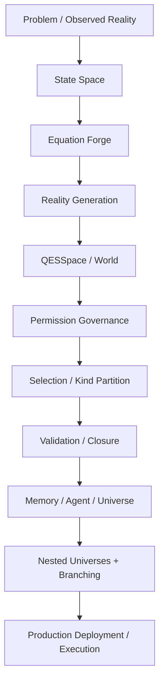
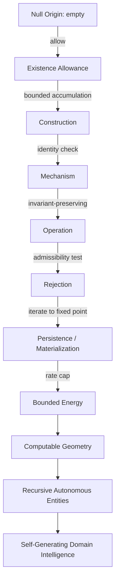
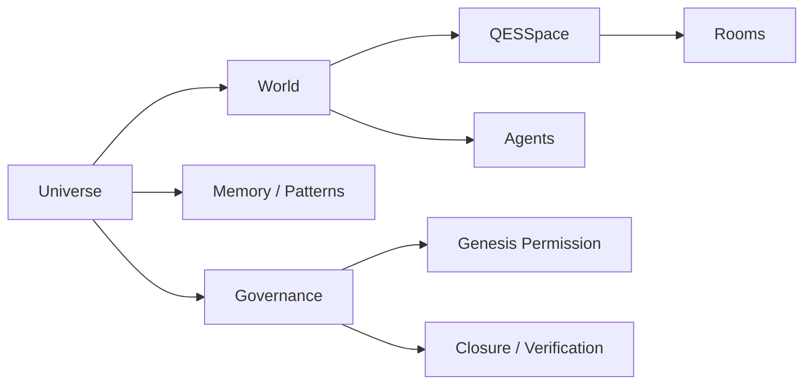
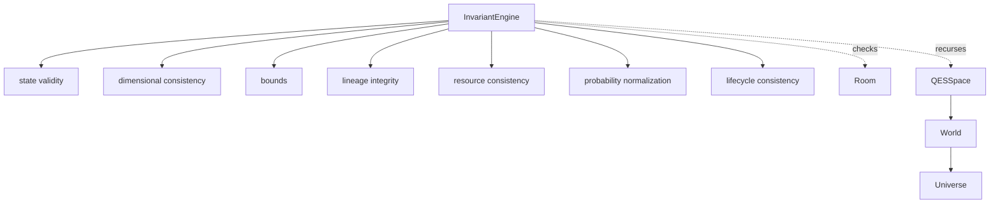
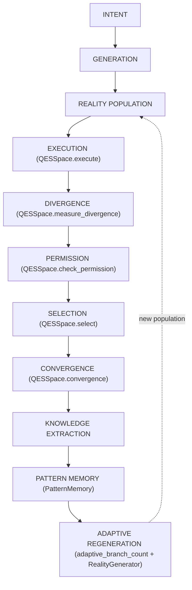
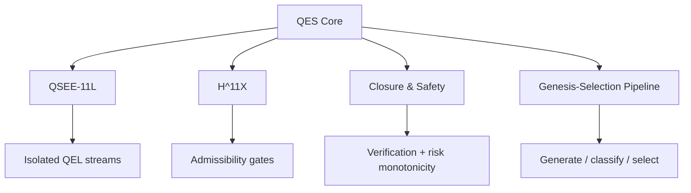

# QES architecture narrative

QES is best understood as a layered computational universe rather than a single optimizer.

## Layered composition



At the top is the problem definition and the observed reality. QES transforms that into a bounded state space, generates candidate realities, evaluates them through permission and closure layers, then picks the best survivors and reuses the results as memory and future generation seeds.

## Digital Existence Kernel

Underneath the layers above sits a deeper, 11-layer closed core — the
`qes.kernel` module — that governs whether a candidate digital entity comes
into existence at all, before it ever reaches `QESSpace`, `World`, or
`Universe`:



The key distinction this kernel gives QES: **a digital object does not
exist merely because its class or source code exists.** It must be
explicitly *allowed* out of the null origin, accumulate complexity only
under *bounded construction*, transition only while *identity-preserving*
(`Mechanism`), and can be *rejected into non-existence* rather than
generated and deleted later (`Rejection`). A state only *persists* once it
is a stable fixed point under repeated operation (`Persistence`), and its
rate of change is capped by a `Bounded Energy` budget.

This also gives QES a formal "reality compiler" distinction
(`qes.kernel.RealitySelector`): given a candidate possibility space `C`,
the admissible **reality** set is the fixed-point subset

```
R = { x in C : x == Phi(x) }
```

i.e. states that survive their own governing operator unchanged. Generation,
filtering, and realization are therefore not independent stages — stable
existence is itself the result of satisfying the complete operator, which is
how `qes.selection.GenesisSelectionPipeline` and `qes.permission` build
admissibility on top of this kernel rather than filtering after the fact.

## Core runtime model



Each layer is intentionally separate:

- `Room` = a candidate reality
- `QESSpace` = a population-level search engine
- `World` = a local environment with rooms and agents
- `Universe` = a recursive digital space containing one or more worlds, nested universes, and governance rules
- `Agent` = autonomous actor inside a world or universe

## Global invariant engine and event sourcing

Each container above (`Room`, `QESSpace`, `World`, `Universe`) already
implements its own `snapshot()`/`restore()`. `qes.invariants.InvariantEngine`
sits above all of them and recursively checks the structural invariants
that must hold *regardless* of which layer you're inspecting:



`InvariantEngine.check(obj)` dispatches on `obj`'s type and returns an
`InvariantReport` listing every violation found (not just the first),
without mutating anything or raising — callers decide whether to log,
refuse to persist, or `restore()` a prior checkpoint.

`qes.events` complements this with an event-sourcing layer: every
important state transition can be recorded as one of the canonical event
kinds

    SPAWN -> EXECUTE -> DIVERGE -> PERMISSION -> MUTATE -> SELECT -> MERGE -> COLLAPSE

via `EventLog`. `LineageGraph` tracks parent/child provenance between any
tracked entities (rooms, equations, decisions, ...), and
`DeterministicReplay` (backed by `state_hash`, a SHA-256 content hash of a
state array) verifies that replaying a recorded event sequence from a
checkpoint reproduces bit-identical states — the foundation for
reproducible experiments.

## Reality operators and families (Phase 3)

`qes.reality_generator.RealityGenerator` branches one parent into many
children via i.i.d. Gaussian noise or stratified Latin Hypercube sampling.
`qes.reality_operators` adds the richer per-child operators the roadmap
calls for -- `mutation`, `crossover`, `interpolate`, `extrapolate`,
`inversion`, structured `perturbation` (along explicit directions),
`dimensional_transformation`, `topology_transformation`,
`equation_substitution`, `parameter_transformation` -- each a pure,
deterministic `Room -> Room` numpy transform built on `Room.clone()`.
`RealityFamily` groups a batch of siblings with aggregate statistics
(`mean_state()`, `diversity()`, `best()`) instead of a flat, unrelated
room list, and `RealityFamilyBuilder` composes several operators (mutate,
invert, and -- given a second parent -- crossover/interpolate/
extrapolate) into one family in a single call.

## Equation Forge 2.0 (Phase 4)

`qes.equation_ast` gives equations a real tree structure (`EquationAST` ->
`Constant`/`Variable`/`Operator` nodes over a registered `Primitive`
library) instead of a flat string, so mutation/crossover/simplification
can act on individual subtrees (`subtree_at`/`replace_subtree`) rather
than regenerating a whole equation. `EquationASTForge` runs a
fitness-driven evolution loop over a population of these trees, gated by
`DimensionValidation`/`NumericalValidation`/`StabilityReport` so unstable
or dimensionally-inconsistent candidates are screened out before they're
trusted.

## Reality-to-reality communication (Phase 6)

`qes.communication.CommunicationFabric` lets rooms exchange state,
knowledge, and pattern payloads directly (`exchange_state`/
`exchange_knowledge`/`exchange_pattern`) instead of only interacting
through shared `PatternMemory`. `ResourceNegotiation` runs a bidding round
where rooms submit `ResourceBid`s with an expected utility and a shared
compute budget is allocated proportionally, gated by the existing
permission closure. `compete`/`cooperate`/`form_coalition` add pairwise
contests, N-way cooperative aggregation, and named `Coalition` formation
on top of the same room objects.

## Causal Reality Engine (Phase 5)

`qes.causal_engine` inserts a causal-analysis layer between "a room has a
state" and "the framework should act on that state." Instead of only
tracking whether one candidate scored better than another, QES can now
attach a named DAG of variables/factors (`CausalGraph`) to the domain and
ask: what changed because of an intervention, what would have happened
under a different observed value, which variables are locally sensitive,
and which strong correlations remain unexplained by the current graph.

The implementation is intentionally explicit and bounded. Edge weights are
linearized delta-flow coefficients, so `intervene()` and `counterfactual()`
propagate state changes through the DAG as ordinary Python/NumPy
bookkeeping, not as a symbolic structural-equation solver and not as
literal philosophical causality discovery. In the layered story, this fits
between raw state evolution and later decision stages: it helps explain why
a candidate or outcome moved, which in turn feeds verification,
adversarial testing, and knowledge-graph provenance.

## Information Gain Engine (Phase 8)

`qes.information_gain` operationalizes `IG(a) = H(before) - H(after)` by
reusing `qes.convergence.qes_entropy` as the entropy measure:
`population_entropy` scores a room population's weight distribution,
`InformationGainEstimator` tracks per-candidate entropy history over
time, and `rank_by_information_gain`/`allocate_by_information_gain` turn
those scores into a priority ranking and a compute-budget split -- the
priority signal `qes.compute_allocator.ComputeAllocator` and
`AutonomousCycle` can consume when deciding which branch to fund next.

## Persistent Knowledge Graph (Phase 12)

`qes.knowledge_graph.KnowledgeGraph` is a typed, JSON-persistable
provenance graph over the Reality -> Observation -> Equation -> Pattern
-> Result -> Causal-relation chain the roadmap calls for. It complements
`qes.events.LineageGraph` (which tracks raw event provenance): where
`LineageGraph` records *that* one entity produced another,
`KnowledgeGraph` additionally labels nodes success/failure
(`successful_configurations`/`failed_configurations`), tracks
strengthenable `CausalHypothesis` cause/effect confidence
(`record_causal_hypothesis`/`strengthen_hypothesis`), tags
counterexamples that disprove a named concept, and records cross-domain
relationships -- then round-trips the whole graph through JSON via
`save()`/`load()` so a later QES run can query "what happened last time"
instead of starting from zero.

## Reality Marketplace (Phase 7)

`qes.marketplace` sits where several candidate realities compete for scarce
resources after QES has already learned something about their utility,
risk, novelty, and information value. Phase 6's `ResourceNegotiation`
handled one bidding interaction at a time; Phase 7 generalizes that into a
stateful market with registered `RealityAccount`s, multi-resource
`MarketBid`s, a transparent `compute_allocation_score()`, and a
`RealityMarketplace` that clears compute, memory, and energy rounds while
respecting per-account caps and historical performance.

Architecturally, this is the bridge between scoring and execution. The
market does not replace `ComputeAllocator`; it reuses it for the actual
proportional splitting step once a richer Phase 7 competitiveness score is
computed. That keeps the economics honest: it is still classical budget
bookkeeping over finite CPU/RAM-style resources inside one process, just
with a more expressive model of why one candidate should receive more of
that budget than another.

## Digital Twin 2.0 (Phase 9)

QES already had `qes.digital_twin.DigitalTwin` for residual/error anchoring.
`qes.digital_twin_loop` turns that anchor into a fuller closed estimation
and prediction loop: raw `Observation`s are fused with inverse-variance
`sensor_fusion()`, assimilated by a `StateEstimator` (linear Kalman
filter), optionally adapted by an `OnlineParameterEstimator` (recursive
least squares), ranked across alternative predictive models by
`ModelSelector`, then pushed forward through `uncertainty_propagation()` to
produce prediction intervals, anomaly flags, drift checks, and a plain
recommended action.

In the layered architecture, this is the point where QES stops being only a
search over hypothetical rooms and starts behaving like a practical digital
twin loop around a changing observed system. The implementation is still
ordinary CPU/RAM numerical estimation -- no literal quantum compute, no
free forecasting, no hidden hardware acceleration -- but it gives QES a
coherent "observe -> update -> branch -> predict -> react" story that fits
industrial monitoring and control-flavored use cases.

## Backend abstraction and distributed coordination (Phases 10-11)

`qes.backend` and `qes.distributed` extend the runtime substrate beneath the
higher search logic. `qes.backend` defines `ComputeBackend` plus a working
`NumpyBackend`, honest optional `GPUBackend`, backend registry helpers, and
repeatable backend benchmarking. The important architectural point is that
QES array code can target a backend interface without pretending that a GPU
exists: CPU NumPy is the guaranteed path, and accelerator support activates
only when a real CuPy or CUDA-enabled PyTorch runtime is present.

`qes.distributed` adds the next layer out: not real multi-machine execution,
but a faithful in-process simulation of the controller logic that a real
distributed runtime would need. `Controller` manages `WorkItem`s, worker
discovery, heartbeats, leases, timeout recovery, GPU-aware placement,
checkpoint/restore, and autoscaling hints; `Worker` runs those assignments
on Python threads. So the architecture gains the coordination semantics of a
distributed system without claiming that this repository already provisions a
cluster or cloud deployment.

## Meta-learning (Phase 13)

`qes.meta_learning` raises the adaptation layer one level higher: instead of
only mutating candidate rooms, QES can adapt the search strategy itself.
`ProblemStructure` captures a cheap, honest feature vector for a problem
(dimensionality, bounds width, ruggedness, noise, constraint count,
gradient availability). `MetaController.recommend()` starts from transparent
defaults, looks for similar prior `SearchOutcome`s in `SearchHistory` (and
optionally `PatternMemory`), then nudges optimizer choice, mutation rate,
population size, branching factor, exploration/exploitation balance, and
convergence threshold toward historically successful settings.

This belongs above the autonomous cycle rather than inside it: Phase 2
decides how a single run regenerates itself; Phase 13 decides how future
runs should be configured before they start. The implementation is honest
heuristic adaptation over tracked history, not a black-box learner and not a
claim that QES discovers optimal hyperparameters for free.

## Self-improvement, verification, and adversarial testing (Phases 14-16)

Phases 14-16 form a governance bundle around the search engine itself.
`qes.self_improvement` proposes alternative strategy dictionaries
(`ArchitectureProposal`), benchmarks them in an isolated `Sandbox`, runs
safety and regression gates, and only then lets `SelfImprovementPipeline`
record an approved configuration in an in-memory strategy library. That is
"self-improvement" in the narrow, honest sense of trying alternative search
policies under governance -- never rewriting production source code.

`qes.verification` then formalizes what it means for a candidate to be
credible. `VerificationEngine` assembles numerical, constraint, safety,
stability, invariant, and cross-domain checks into an ordered `Evidence`
package, so callers get more than a single score: they get a staged reason
for trust or rejection. `qes.adversarial` complements that by generating the
deliberately bad cases a verification stack should survive -- boundary
probes, unstable states, singular numeric cases, coupling stressors, and
resource exhaustion -- then aggregating the outcomes into a `RedTeamReport`.
Together these phases turn QES from a search framework into a governed
search framework that can test itself without pretending to be a theorem
prover, an AGI system, or a self-rewriting codebase.

## Multi-agent QSEE evolution (Phase 17)

`qes.multi_agent_evolution` revisits the repository's QSEE theme from a more
practical angle. Instead of eleven isolated low-level streams alone, Phase
17 instantiates eleven lightweight `SpecializedAgent`s -- exploration,
mathematics, optimization, verification, safety, prediction, resource
allocation, causal analysis, adversarial testing, synthesis, and
validation -- each scoring the same candidate pool with a documented
heuristic. `AgentPopulation` then runs competition, Borda-style
cooperation, knowledge exchange, coalition formation, and a final collective
choice, with `compare_individual_vs_collective()` measuring whether the
population's consensus beat its individual members.

Architecturally this is not a second agent runtime that replaces
`qes.agent.Agent`; it is a decision-layer ensemble built on top of candidate
features. That distinction matters to the repository's honesty framing: the
phase adds diversity of scoring pressure and explicit collective-vs-
individual comparison, not autonomous LLM society or literal machine
consciousness.

## Benchmarking and reproducibility (Phases 18-19)

`qes.bench` and `qes.reproducibility` complete the scientific-engineering
story around the core runtime. `qes.bench` defines bounded
`BenchmarkProblem`s, runs the real QES optimizer under an exact evaluation
budget, and compares it against a set of honestly labeled minimal reference
baselines (plus SciPy-backed differential-evolution / gradient-method
runners when SciPy is actually available). The point is not to claim SOTA
performance; it is to give QES a repeatable way to say how it behaves under
matched conditions.

`qes.reproducibility` ensures those claims can be replayed.
`ExperimentRecorder` captures code version, git commit, hardware metadata,
configuration, seeds, lineage, equations, decisions, allocations, results,
failures, and final evidence into an `ExperimentArtifact`;
`reproduce_experiment()` and `verify_reproduction()` then re-run and compare
artifacts under the same saved inputs. In the layered architecture, these
modules sit around the outside of everything else: they do not change how
QES searches, they make its behavior measurable, comparable, and replayable.

## Observatory (Phase 20)

`qes.observatory` is the final integrative layer: a dependency-free plain-
text dashboard for looking at a live QES state without needing a web stack.
`ObservatorySnapshot` holds the headline metrics, `render_reality_tree()`
turns parent/child relationships into a box-drawing tree,
`ObservatoryDashboard.render()` formats the full display, and
`build_snapshot_from_modules()` pulls in optional summaries from divergence,
permission, marketplace, digital-twin-loop, adversarial, multi-agent, and
knowledge-graph outputs.

In architecture terms, the observatory does not add new optimization logic;
it adds cross-module visibility. That makes it the narrative endpoint of the
layered universe story: after QES can generate, govern, coordinate, verify,
benchmark, and reproduce candidate realities, it also needs one honest place
to inspect the whole system as a single textual snapshot.

## Domain packs and the QES SDK (Phases 21-22)

Every layer above this point is a general-purpose primitive: you still have
to wire `RealityGenerator` + `QESSpace` + a permission kernel + pattern
memory together yourself for each new problem, as `examples/basic_run.py`,
`examples/control_policy_search.py`, `examples/design_space_search.py`, and
`examples/resource_allocation.py` all do by hand. Phases 21 and 22 add a
convenience layer *on top of* the core engine, without introducing any new
search algorithm:

- `qes.domain_packs` turns three recurring problem shapes into reusable,
  validated adapters: `ControlPolicyPack` (controller-gain search over
  bounded plant dynamics), `DesignSpacePack` (constrained structural-design
  search), and `ResourceAllocationPack` (priority-weighted job/compute
  allocation, built on `qes.compute_allocator`). `DomainPackRegistry` and
  `list_domain_packs()` make the available packs discoverable at runtime.
- `qes.sdk` gives the whole framework a single ergonomic front door:
  `QESClient` accepts state bounds, a step function, and optional permission
  configuration, then assembles the same `RealityGenerator` + `QESSpace` +
  `GenesisPermission`/`AdaptivePermission` + `PatternMemory` machinery every
  other example wires by hand, exposing one `.run(steps=N)` call that
  returns an `SDKRunResult` (best room/state, final entropy/convergence,
  wall time, step count). `quick_search()` is a one-line convenience
  function for the simplest bounded-search use case.

Both modules are pure orchestration and validation glue: every number they
report is produced by the pre-existing `qes.*` engine, not by new
computation. Their purpose is developer ergonomics -- turning "assemble ten
primitives correctly" into "call one function" -- not a new layer of the
formal specification.

## Closed-loop autonomous cycle (Phase 2)

`QESSpace.step()` already implements the inner master operator
``Q_{t+dt} = C o S o P o D o E o G``. `qes.cycle.AutonomousCycle` wraps it
with the outer ring the roadmap calls out as "the single most important
next architectural step" -- turning one measured pass into a genuinely
self-driving loop:



Each generation also gets an `InvariantEngine.check_space()` pass and
`SPAWN`/`EXECUTE`/`DIVERGE`/`PERMISSION`/`SELECT`/`MERGE` events recorded
to an `EventLog`, so the loop is self-driving *and* fully auditable.
`adaptive_branch_count()` decides how many children the next generation
gets from uncertainty, risk, divergence, compute budget, novelty, and
this intent's historical success rate -- documented as a heuristic, not
a literal physical law. This is still an ordinary classical loop: each
generation costs measured CPU/RAM (see
`examples/closed_loop_cycle.py`); "closed-loop" means no human re-seeds
the population between generations, not that computation is free.

## Why this is a framework, not an app

The framework does not encode one domain-specific problem. You provide the domain semantics:

- state bounds
- objective and risk model
- admissibility rules
- update dynamics

Then QES handles the execution lifecycle:

1. spawn candidate realities
2. evolve them
3. measure divergence
4. apply permission gates
5. classify by kind
6. select the best survivor(s)
7. converge and retain memory
8. branch or collapse when needed

## Governance stack

The deeper advanced layers extend the base framework with formal governance:



This is what makes the repository feel like a digital-universe platform rather than a simple optimization toy: the framework includes not only room-level search but also governance, safety, structural isolation, and layered selection.

## Practical interpretation

A production system built on QES could look like this:

- a `World` for one engineering domain or simulation regime
- a `QESSpace` for exploring candidate designs or control policies
- `Agent`s for monitoring, routing, or policy adaptation
- `Universe` as the top-level runtime that orchestrates several worlds and nested experiments
- selection and verification layers that reject unsafe runs early

This is the core value proposition: the framework gives you a governed possibility-space execution system that can be specialized toward optimization, simulation, design, operations, or digital-twin workflows.
